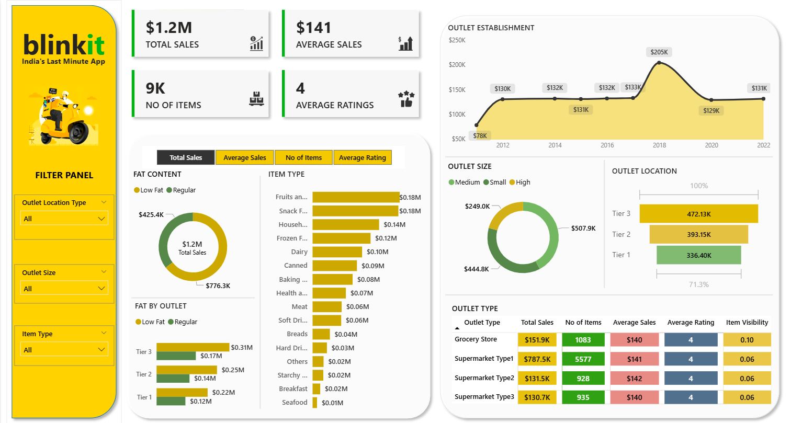

# 🛒 Blinkit Sales Analytics Dashboard — Power BI



## 📌 Project Overview

This Power BI dashboard provides a comprehensive sales analytics overview for **Blinkit** (India's Last Minute App). It enables stakeholders to monitor key business metrics, analyze sales trends across outlet types and locations, and drill down into product-level performance — all in one interactive view.

---

## 📊 Key Metrics (KPIs)

| Metric | Value |
|---|---|
| 💰 Total Sales | $1.2M |
| 📦 Number of Items | 9K |
| 📈 Average Sales | $141 |
| ⭐ Average Ratings | 4 |

---

## 📂 Dashboard Sections

### 1. Fat Content Analysis
- Donut chart comparing **Low Fat vs. Regular** product sales
- Low Fat: $425.4K | Regular: $776.3K | Total: $1.2M
- Fat breakdown by outlet tier (Tier 1, 2, 3) using grouped bar charts

### 2. Item Type Performance
- Horizontal bar chart ranking all product categories by total sales
- Top performers: **Fruits & Vegetables** and **Snack Foods** at $0.18M each
- Full category list including Dairy, Frozen Foods, Canned, Baking, Meat, Soft Drinks, and more

### 3. Outlet Establishment Timeline
- Line/area chart showing outlet sales from **2012 to 2022**
- Peak recorded at **$205K in 2018**; most recent value at **$131K in 2022**

### 4. Outlet Size Breakdown
- Donut chart segmenting sales by outlet size: **Medium, Small, High**
- Medium: $507.9K | Small: $444.8K | High: $249.0K

### 5. Outlet Location Performance
- Horizontal bar chart comparing Tier 1, 2, and 3 city locations
- Tier 3 leads with **$472.13K**, followed by Tier 2 ($393.15K) and Tier 1 ($336.40K)

### 6. Outlet Type Summary Table
Detailed table comparing all outlet types across 5 dimensions:

| Outlet Type | Total Sales | No. of Items | Avg. Sales | Avg. Rating | Item Visibility |
|---|---|---|---|---|---|
| Grocery Store | $151.9K | 1083 | $140 | 4 | 0.10 |
| Supermarket Type 1 | $787.5K | 5577 | $141 | 4 | 0.06 |
| Supermarket Type 2 | $131.5K | 928 | $142 | 4 | 0.06 |
| Supermarket Type 3 | $130.7K | 935 | $140 | 4 | 0.06 |

---

## 🔍 Filter Panel

The dashboard includes interactive slicers for dynamic filtering:
- **Outlet Location Type** — Filter by All / Tier 1 / Tier 2 / Tier 3
- **Outlet Size** — Filter by All / Small / Medium / High
- **Item Type** — Filter by product category

---

## 🛠️ Tools & Technologies

- **Tool:** Microsoft Power BI Desktop
- **Data Source:** Blinkit grocery sales dataset
- **Visuals Used:** KPI cards, donut charts, bar charts, line/area chart, data table, slicers

---

## 📁 Repository Structure

```
📦 blinkit-powerbi-dashboard
├── 📊 Blinkit_Dashboard.pbix    # Power BI project file
├── 🖼️ Dashboard.png             # Dashboard screenshot
├── 📄 README.md                 # Project documentation
└── 📂 Data/
    └── blinkit_data.csv         # Source dataset (if applicable)
```

## 📈 Key Insights

- **Supermarket Type 1** dominates with 65%+ of total sales and the highest item count
- **Tier 3 cities** generate the most revenue, suggesting strong demand in smaller markets
- **Fruits & Vegetables** and **Snack Foods** are the top-selling product categories
- Sales peaked around **2018** and have stabilised around the $130K–$132K range since 2020
- **Regular fat content** products outsell Low Fat products by nearly 2:1

---

## 🙋‍♂️ Author

**Your Name**
- GitHub: [@Arpita-407](https://github.com/Arpita-407)
- LinkedIn: [arpita](https://www.linkedin.com/in/arpita-thakur/)

---

## 📃 License

This project is for educational and portfolio purposes. Dataset sourced from publicly available Blinkit sales data.
